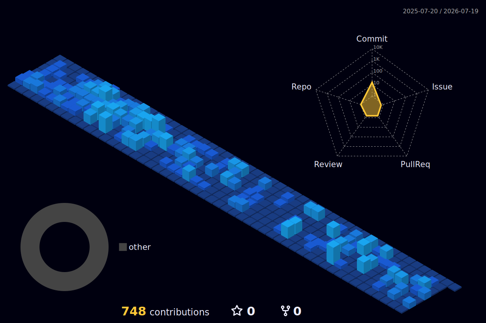

<!-- Banner animado (substitua pela sua cor e nome) -->

  
  
  
  

---

## 🏆 Troféus do GitHub

  

---

## 📊 Estatísticas detalhadas

  
  

---

## 📈 Gráfico de Atividade (últimos 31 dias)

  

---

## 🧊 Contribuições em 3D

  

---

## 🛠 Stack Principal

  
  
  
  
  
  
  
  

---

## 🧠 Em órbita (estudando agora)

- ⚛️ Computação Quântica (Qiskit, IBM Quantum)
- 🏗️ Arquitetura Limpa & Design Patterns
- ⚡ React Server Components & Next.js
- 🧪 Testes automatizados (Jest, Cypress)
- ☁️ AWS (Lambda, S3, DynamoDB)

---

## 🌌 Projetos em Destaque

  
  

---

## 🎧 Toque Pessoal

<!-- Idade em tempo real (substitua pela sua data) -->

  

<!-- (Opcional) Música que estou ouvindo agora – veja instruções abaixo -->
<!--

  

-->

---

## ✨ Citação

   
  <strong>✨ “O universo não é apenas mais estranho do que supomos, é mais estranho do que podemos supor.” 🚀</strong>
   
  
    Probabilidade de você estar lendo isso: ~1 em 400 trilhões. Obrigado por existir.
  

